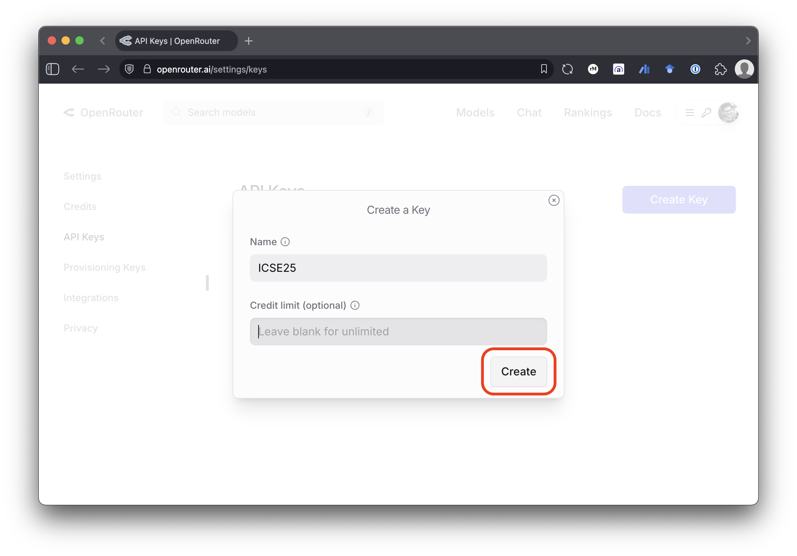

# ICSE 2025 CLDK Tutorial

In this hands on session we will explore the CLDK and its capabilities with a few real-world examples of using the CLDK and LLMs to build:

1. a code summarization tool: See [Code Summarization](./1-codesummary.ipynb)
2. a test generation tool: See [Test Generation](./2-testgeneration.ipynb)

## 1.  Prerequisites

1. Install CLDK and java bindings. Detailed set-up instructions can be found in the [CLDK documentation](https://codellm-devkit.info/installing/#java-analysis).
2. An openrouter API key to access some opensource LLMs. If you don't have an account, you can sign up for free at [openrouter.ai/sign-up](https://openrouter.ai/sign-up).


## 2. Tutorial setup

1. First, let's clone this repository and navigate to the directory:

   ```bash
   git clone https://github.com/codellm-devkit/cldk-tutorial.git && \
   cd cldk-tutorial
   ```

2. Next, create a `.env` file in the root directory.

   ```bash
   touch .env
   ```

### Create openrouter API key

Log in to your openrouter account and create a new [API key](https://openrouter.ai/settings/keys). 


   **Fig 1. Click "Create Key"**


   **Fig 2. Generate a name and click "Create"**


   **Fig 3. Copy the API key**

Copy the API key and paste it into the `.env` file as follows:

```bash
# .env
OPENROUTER_API=sk-rest-of-your_api_key-here
# Ensure to replace 'sk-rest-of-your_api_key-here' with your actual API key
```

### Install dependencies and requirements
Finally, let's install the required dependencies. You can do this by running the following command in your terminal:

   ```bash
   python -m venv .venv
   source .venv/bin/activate
   pip install -U -r requirements.txt
   ```

### Start the Jupyter Notebook server

You have two options to start the Jupyter Notebook server:
1. **Using the command line**: Run the following command in your terminal:
   ```bash
   ./.venv/bin/jupyter notebook
   ```
   This will start the Jupyter Notebook server and open it in your default web browser.

2. Recommended: **Using VSCode**: From inside the `cldk-tutorial` directory you can open VSCode:
   ```bash
   code .
   ```
   This will open the current directory in VSCode. You can then open the Jupyter Notebook files and run them directly from there. 
   
   
   Make sure to select the correct Python interpreter (the one inside the `.venv` directory) in VSCode. You can do this
   by selecting the Python kernel in the top right corner of the notebook.
   

### 🏁 End of the tutorial!

Make sure you deactivate the virtual environment when you are done with the tutorial. You can do this by running the following command in your terminal:

```bash
deactivate
```
This will deactivate the virtual environment and return you to your system's default Python environment.

## Feedback

Join our community on Discord/Github to discuss CLDK and share your experiences with other users:
- [Github Discussion](https://github.com/orgs/codellm-devkit/discussions)

For any questions, feedback, or suggestions, please contact the authors:

| Name          | Email                                               |
| ------------- | --------------------------------------------------- |
| Rahul Krishna | [i.m.ralk@gmail.com](mailto:i.m.ralk@gmail.com)     |
| Rangeet Pan   | [rangeet.pan@ibm.com](mailto:rangeet.pan@gmail.com) |
| Saurabh Sihna | [sinhas@us.ibm.com](mailto:sinhas@us.ibm.com)       |